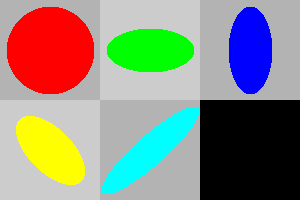

# the-ray-tracer-challenge

Follows the "The Ray Tracer Challenge" book by Jamis Buck.

The book does not use a specific programming language, it only uses tests and pseudocode to describe the logic and functions. Hence part of the challenge is to convert the requirements into Rust code.

## Chapter 06

## Chapter 05

